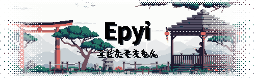


# Hey boy'z and girl'z ! 👋

### 　人 &nbsp;About

- Dev **[FiveM](https://fivem.net/)** en Lua depuis ~9 ans
- Dev **Minecraft**, mods Java / Forge
- Age: **NaN** &nbsp;·&nbsp; Location: **Localhost**

### 　組 &nbsp;Organizations

- **[@LyreScripts](https://github.com/lyrescripts)** &nbsp;·&nbsp; Boutique de scripts FiveM premium
- **[@LetsBlox](https://github.com/letsblox)** &nbsp;·&nbsp; Un studio créant des jeux Roblox
- **[@EsperiaRp](https://github.com/EsperiaRp)** &nbsp;·&nbsp; La référence du roleplay sur Minecraft
- **[@ClanscraftMC](https://github.com/ClanscraftMC)** &nbsp;·&nbsp; Serveur Minecraft PvP faction revisité
- **[@MetropiaRP](https://github.com/metropiarp)** &nbsp;·&nbsp; Serveur Minecraft Roleplay médieval fantastique
- **[@Back-To-Roleplay](https://github.com/Back-To-Roleplay)** &nbsp;·&nbsp; Serveur FiveM
- **[@GameWorkersArea](https://github.com/gameworkersarea)** &nbsp;·&nbsp; Communauté de développeurs de mods pour FiveM et autres jeux
- **[@unleashedprojectfivem](https://github.com/unleashedprojectfivem)** &nbsp;·&nbsp; Serveur FiveM post-apo
- **[@yourscript](https://github.com/yourscript)** &nbsp;·&nbsp; Boutique de scripts FiveM d'un ami, [gtolontop](https://github.com/gtolontop)

### 　具 &nbsp;Stack

  
  
  
  
  
  

### 　縁 &nbsp;Links

- [lyrescripts.com](https://lyrescripts.com/)
- [Game Workers Area Community](https://discord.gg/VyRPheG6Es) &nbsp;·&nbsp; Discord
- [Metropia Roleplay](https://metropia.fr/) &nbsp;·&nbsp; Site internet
- [Clanscraft](https://clanscraft.fr/) &nbsp;·&nbsp; Site internet

